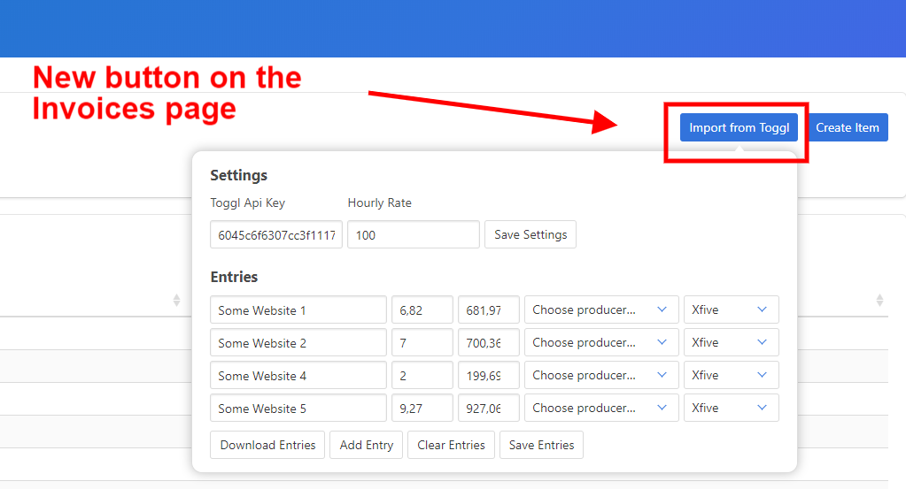
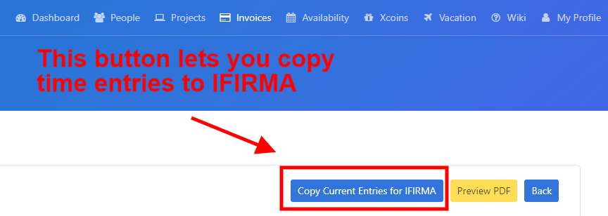
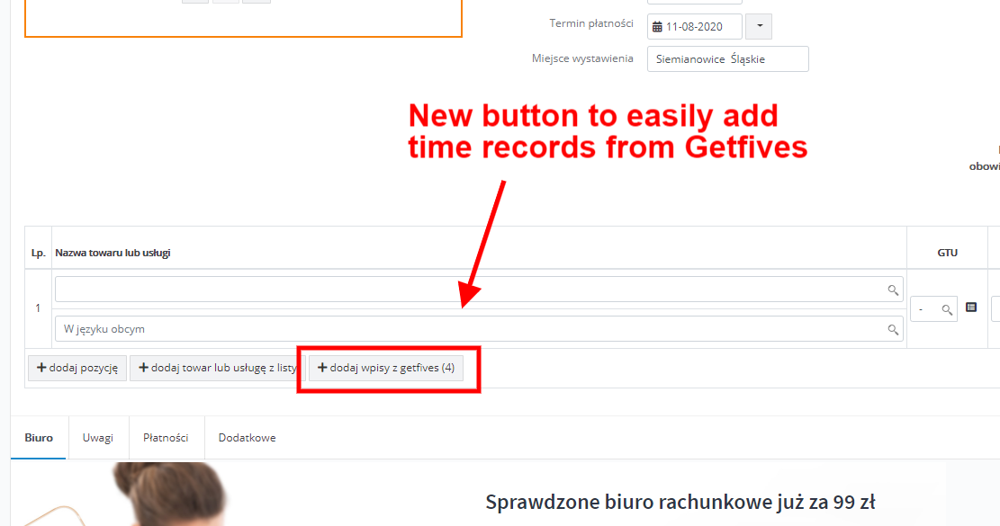

# Toggl - Getfives - IFIRMA integration
Chrome plugin for importing tasks from Toggl to Getfives. 
It adds a button on Getfive invoices page which allows you to import all 
tasks from current month.  
It also adds a button on IFIRMA invoice edit which imports tasks from the current month.

## Screenshots showing plugin in action

*Button for importing and adding entries from Toggl on Getfives invoices page*
    

*In a particular month you can copy all entries and then use in IFIRMA page*
  

*Having some entries copied you can import the into invoic on IFIRMA page*
